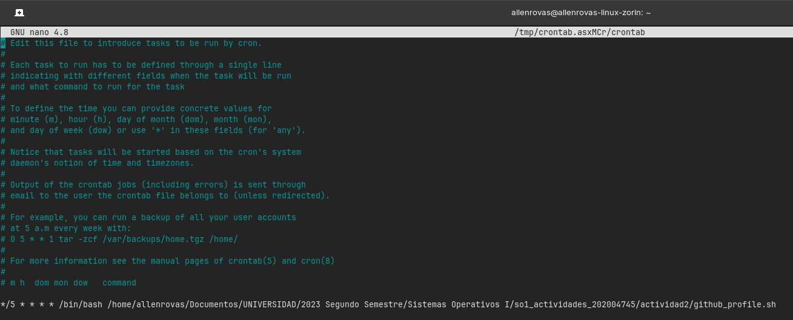

# **Actividad 2**

# **Allen Giankarlo Román Vásquez - 202004745**

## Script

```
#!/bin/bash
```
El shebang le dice al sistema que el script debe ser ejecutado utilizando el intérprete de comandos Bash.

```
echo "---------- Actividad 2 - 202004745 ----------"
read -p "Introduce el nombre de usuario de GitHub: " GITHUB_USER
echo " "
```
Estas líneas muestran un mensaje al usuario ("Actividad 2 - 202004745"), luego solicitan al usuario que introduzca el nombre de usuario de GitHub y almacenan la entrada en la variable GITHUB_USER.

```
DATA=$(curl -sL https://api.github.com/users/$GITHUB_USER)
```
Esta línea utiliza el comando curl para realizar una consulta a la API de GitHub y obtiene los datos del usuario especificado en la variable GITHUB_USER. Los datos de la consulta se almacenan en la variable DATA.

```
if [ "$(echo $DATA | jq -r '.message')" != "Not Found" ]; then
```
Esta línea verifica si la respuesta de la API de GitHub contiene el mensaje "Not Found", lo cual indica que el usuario no existe. 

```
github_user=$(echo $DATA | jq -r .login)
id=$(echo $DATA | jq -r .id)
created_at=$(echo $DATA | jq -r .created_at)
```
Estas líneas utilizan jq para extraer diferentes campos del JSON obtenido de la API de GitHub y los almacenan en las variables github_user, id y created_at.

```
echo "---------- Datos del usuario de GitHub ----------"
echo "Hola $github_user. User ID: $id. Cuenta fue creada el: $created_at."
echo " "
```
Aquí se muestran los datos del usuario obtenidos de la API. 

```
fecha=$(date +%Y%m%d)
log_dir="/tmp/${fecha}"
log_file="${log_dir}/saludos.log"

mkdir -p "$log_dir"
echo "Hola $github_user. User ID: $id. Cuenta fue creada el: $created_at." >> "$log_file"
```
En estas líneas, se crea un archivo de registro en el directorio /tmp/<fecha>/saludos.log, donde <fecha> es la fecha actual en el formato YYYYMMDD. Luego se crea el directorio y se almacena en la variable log_dir, y se crea la ruta del archivo de registro completo en la variable log_file. Finalmente, se escribe la misma información que se mostró anteriormente en el archivo de registro utilizando el operador >>, que agrega el contenido al archivo en lugar de sobrescribirlo si ya existe.

```
else
    echo -e "\e[0;31m---------- El usuario $GITHUB_USER no existe ----------\e[0m"
fi
```
Esta parte del código se ejecutará si el usuario no existe en GitHub. Muestra un mensaje de error en rojo indicando que el usuario no existe.

```
echo "---------- Fin de la actividad 2 ----------"
```
Esta línea simplemente muestra un mensaje de finalización de la actividad.

## Cronjob
<p align="center">
  
</p>
La ejecución del cronjob se utilizó: 

El símbolo asterisco (*) indica "cualquier valor", por lo que, en este caso, */5 * * * * significa que el comando se ejecutará cada 5 minutos.
Esto indica que se ejecutará el script github_profile.sh utilizando el intérprete de comandos bash ubicado en /bin/bash. El script se encuentra en la ruta siguiente:

```
*/5 * * * * /bin/bash /home/allenrovas/Documentos/UNIVERSIDAD/2023 Segundo Semestre/Sistemas Operativos I/so1_actividades_202004745/actividad2/github_profile.sh
```

