# **Actividad 3**

# **Allen Giankarlo Román Vásquez - 202004745**

## Parte 1: Gestión de Usuarios

### Creación de Usuarios

```
sudo -i
```
Para poder loguearse como el usuario root, ya que sólo el usuario root puede administrar los usuarios.

```
adduser NOMBRE_USUARIO
```
El comando anterior agrega un usuario. En nuestro caso crearemos tres usuarios, creando un grupo con el mismo nombre, los comandos a escribir en consola serían:

```
- adduser usuario1
- adduser usuario2
- adduser usuario3
```
Ejemplificando la creación de un usuario:

<p align="center">
  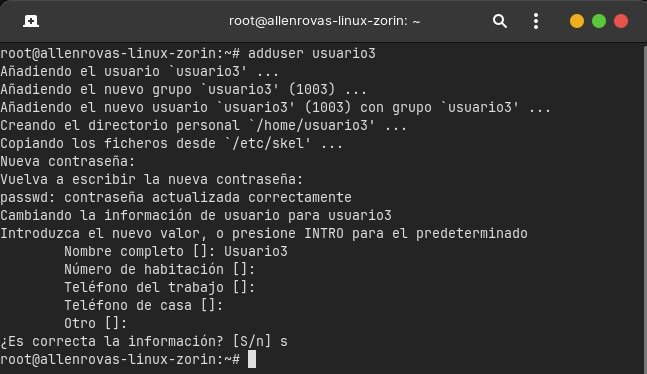
</p>

### Asignación de Contraseñas

```
sudo -i
```
Para poder loguearse como el usuario root, ya que sólo el usuario root puede administrar los usuarios.

```
passwd NOMBRE_USUARIO
```
El comando anterior cambia contraseña a un usuario. En nuestro caso cambiaremos a los tres usuarios creados anteriormente, los comandos a escribir en consola serían:

```
- passwd usuario1
- passwd usuario2
- passwd usuario3
```
Ejemplificando de los cambios de contraseñas:

<p align="center">
  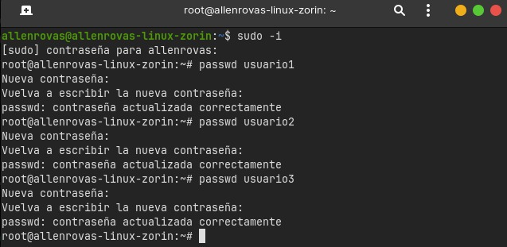
</p>

### Información de Usuarios

```
id NOMBRE_USUARIO
```
El comando anterior cambia imprime en consola el uid, gid y grupos de un usuario. En nuestro caso solicitaremos la información del usuario 1:

```
id usuario1
```
Ejemplificando el comando:

<p align="center">
  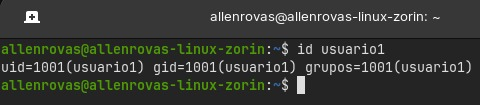
</p>

### Eliminación de Usuarios

```
sudo -i
```
Para poder loguearse como el usuario root, ya que sólo el usuario root puede administrar los usuarios.

```
userdel NOMBRE_USUARIO
```
El comando anterior elimina el usuario, sin eliminar el directorio. En nuestro caso eliminaremos el usuario 3:

```
userdel usuario1
```
Ejemplificando el comando:

<p align="center">
  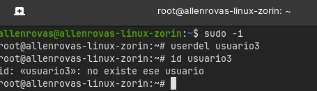
</p>

## Parte 2: Gestión de Usuarios

### Creación de Grupos

```
sudo -i
```
Para poder loguearse como el usuario root, ya que sólo el usuario root puede administrar los usuarios.
```
addgroup NOMBRE_GRUPO
```
El comando agrega un nuevo grupo. En nuestro caso agregaremos dos grupos:

```
- addgroup grupo1
- addgroup grupo2
```
Ejemplificando el comando:

<p align="center">
  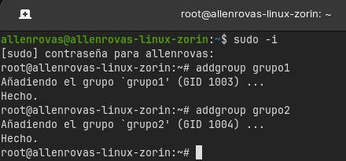
</p>

### Agregar Usuarios a Grupos

```
sudo -i
```
Para poder loguearse como el usuario root, ya que sólo el usuario root puede administrar los usuarios.
```
usermod -aG NOMBRE_GRUPO NOMBRE_USUARIO
```
El comando agrega un usuario a un grupo. En nuestro caso agregaremos dos usuarios a dos grupos diferentes:

```
- usermod -aG grupo1 usuario1
- usermod -aG grupo2 usuario2
```
Ejemplificando el comando:

<p align="center">
  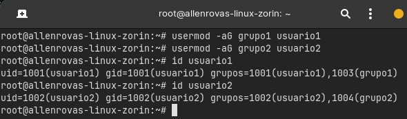
</p>

### Verificar Membresía

```
groups NOMBRE_USUARIO
```
El comando verifica a que grupo pertenece un usuario. En nuestro caso verificaremos dos usuarios de dos grupos diferentes:

```
- groups usuario1
- groups usuario2
```
Ejemplificando el comando:

<p align="center">
  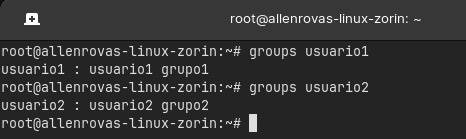
</p>

### Eliminar Grupo

```
sudo -i
```
Para poder loguearse como el usuario root, ya que sólo el usuario root puede administrar los usuarios.
```
delgroup NOMBRE_GRUPO 
```
El comando elimina un grupo. En nuestro eliminaremos un grupo:

```
delgroup grupo2
```
Ejemplificando el comando:

<p align="center">
  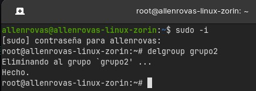
</p>

## Parte 3: Gestión de Permisos

### Creación de Archivos y Directorios

<table align="center" >
  <tr>
  <th> Creación de archivo1.txt como usuario1 en el directorio principal</th>
  <th> Creación de un directorio llamado directorio1 y dentro del directorio creación del archivo2.txt </th>
  
  <tr>
  <th>
  
  ```
  sudo login usuario1
  ```
  Para poder loguearse como el usuario usuario1.

  ```
  nano archivo1.txt
  ```
  Ejecutamos el comando nano que despliega la siguiente ventana de editor de textos:
  <p align="center">
    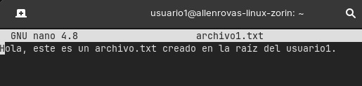
  </p>
  En esta escribimos el contenido del archivo1.txt y guardamos el contenido.
  <p align="center">
  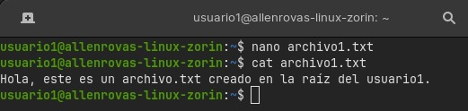
  </p>
  </th>
  <th>

  ```
  sudo login usuario1
  ```
  Para poder loguearse como el usuario usuario1.
  ```
  mkdir directorio1
  ```
  El comando mkdir crea un directorio en la carpeta actual, en este caso la raíz del usuario1.
  ```
  cd directorio1
  ```
  El comando cd nos posiciona en el directorio seleccionado, en este caso directorio1.

  ```
  nano archivo2.txt
  ```
  Ejecutamos el comando nano que despliega la siguiente ventana de editor de textos:
  <p align="center">
    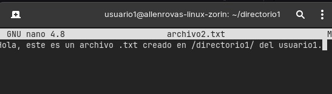
  </p>
  En esta escribimos el contenido del archivo1.txt y guardamos el contenido.
  <p align="center">
  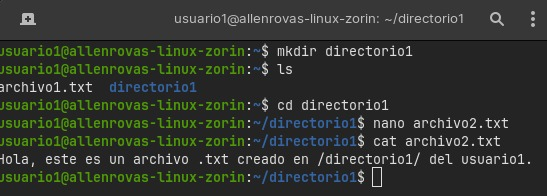
  </p>
  </th>
  </tr>
</table>

### Verificar Permisos
En la posición de la raíz del usuario1, aplicamos los siguientes comandos: 
```
ls -l archivo1.txt
```
```
ls -ld directorio1
```
```
ls -l directorio1/archivo2.txt
```
Como en el siguiente ejemplo:
<p align="center">
  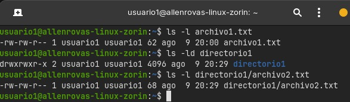
</p>

### Modificar Permisos usando `chmod` con Modo Numérico
Nos ubicamos en el directorio a cambiar los permisos, se aplica el siguiente comando en este caso para que sólo `usuario1` pueda leer y escribir (permisos `rw-`), el grupo pueda leer (permisos `r--`) y nadie más pueda hacer nada:
```
chmod 640 archivo1.txt 
```
<p align="center">
  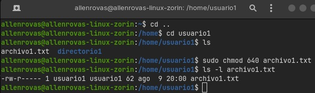
</p>

### Modificar Permisos usando `chmod` con Modo Simbólico:

Nos ubicamos en el directorio a cambiar los permisos, se aplica el siguiente comando en este caso para agregar permiso de ejecución al propietario del `archivo2.txt`:
```
chmod u+x archivo2.txt
```

<p align="center">
  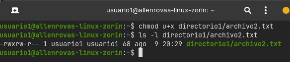
</p>

### Cambiar el Grupo Propietario

Nos ubicamos en el directorio a cambiar el propietario, se aplica el siguiente comando en este caso para hacer propietario del archivo2.txt al grupo1:
```
chown :grupo1 archivo2.txt
```
<p align="center">
  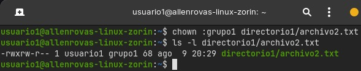
</p>

### Configurar Permisos de Directorio

Nos ubicamos en el directorio a cambiar los permisos, se aplica el siguiente comando en este caso para que sólo el propietario pueda entrar (permisos `rwx`), el grupo pueda listar contenidos pero no entrar (permisos `r--`), y otros no puedan hacer nada:
```
chmod 740 directorio1
```
<p align="center">
  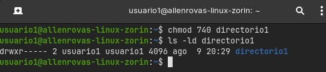
</p>

### Comprobación de Acceso
Después de loguearse como usuario 2 e intentar acceder al archivo2.txt con el comando nano de la siguiente forma:
```
nano directorio1/archivo2.txt
```
Este fue el resultado:
<p align="center">
  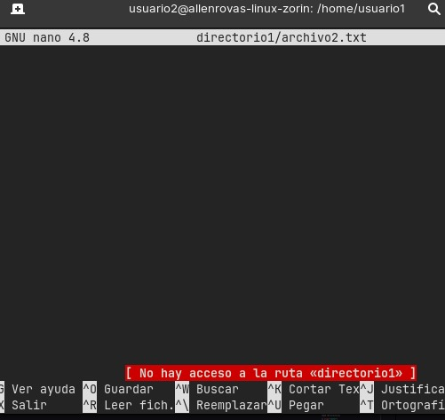
</p>
No hay acceso a la ruta directorio1.


### Verificación Final
Verificación final de permisos con los siguientes comandos:
```
ls -ld directorio1
```
```
ls -l directorio1/archivo2.txt
```
```
ls -l archivo1.txt
```
<p align="center">
  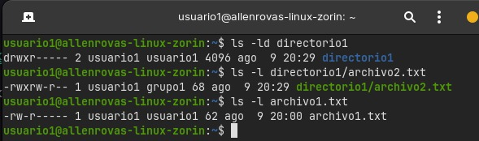
</p>

## Reflexión

### ¿Por qué es importante gestionar correctamente los usuarios y permisos en un sistema operativo?

Porque en ocasiones las máquinas pueden ser utilizadas por distintas personas o por ejemplo a algún trabajador no tiene permisos para hacer ciertas cosas en la máquina, entonces utilizamos los permisos para poder gestionar quien puede ya sea leer, ejecutar o entrar a nuestros archivos.

### ¿Qué otros comandos o técnicas conocen para gestionar permisos en Linux?
El chgrp que se utilizar para cambiar un directorio o archivo de un grupo a otro.
