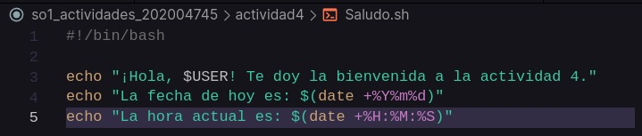
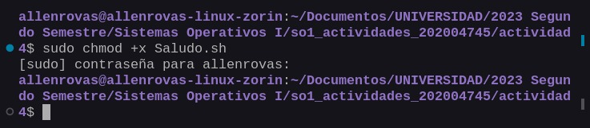
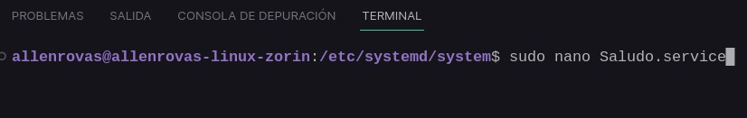
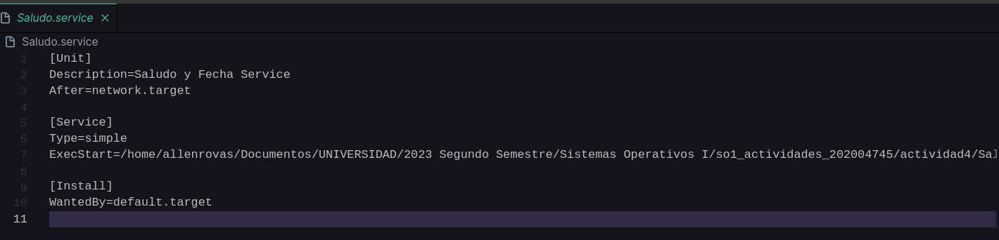
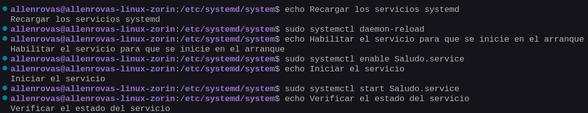
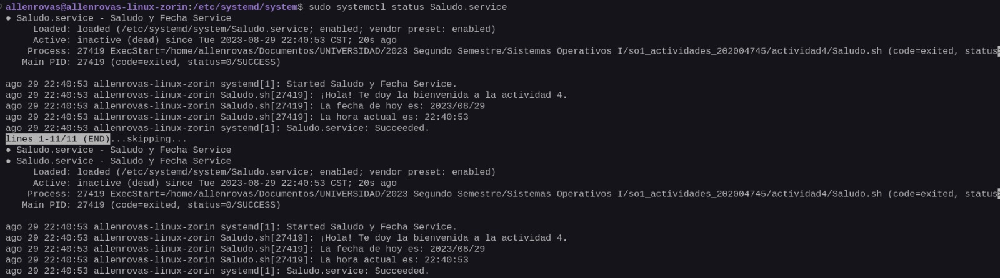

# **Actividad 3**

# **Allen Giankarlo Román Vásquez - 202004745**

## Paso 1: Script

### Crear el script

<p align="center">
  
</p>

### Darle permisos de ejecución

<p align="center">
  
</p>

## Paso 2: Service

### Crear el Service en la carpeta /etc/systemd/system

<p align="center">
  
</p>

<p align="center">
  
</p>

## Paso 3: Instalar y Habilitar el Servicio

### Abrir una terminal con privilegios de administrador y ejecutar los siguiente comandos

```
# Recargar los servicios systemd
sudo systemctl daemon-reload

# Habilitar el servicio para que se inicie en el arranque
sudo systemctl enable saludo_fecha.service

# Iniciar el servicio
sudo systemctl start saludo_fecha.service

# Verificar el estado del servicio
sudo systemctl status saludo_fecha.service

```

<p align="center">
  
</p>

### Comprobar el servicio

<p align="center">
  
</p>